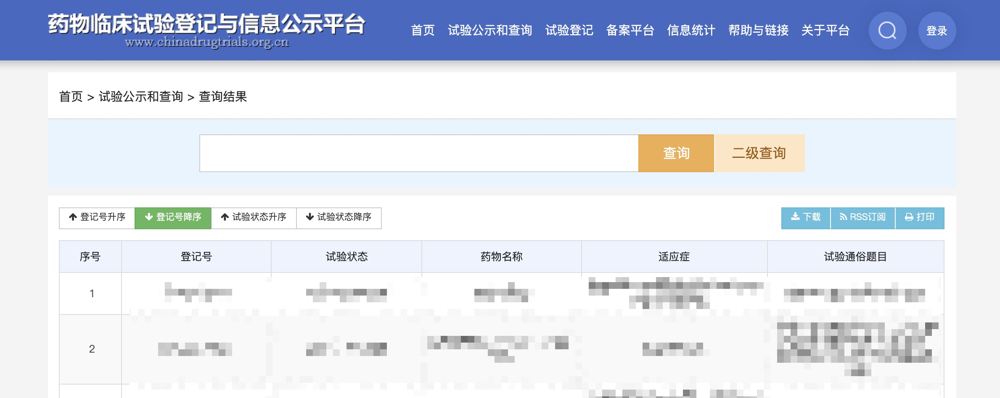
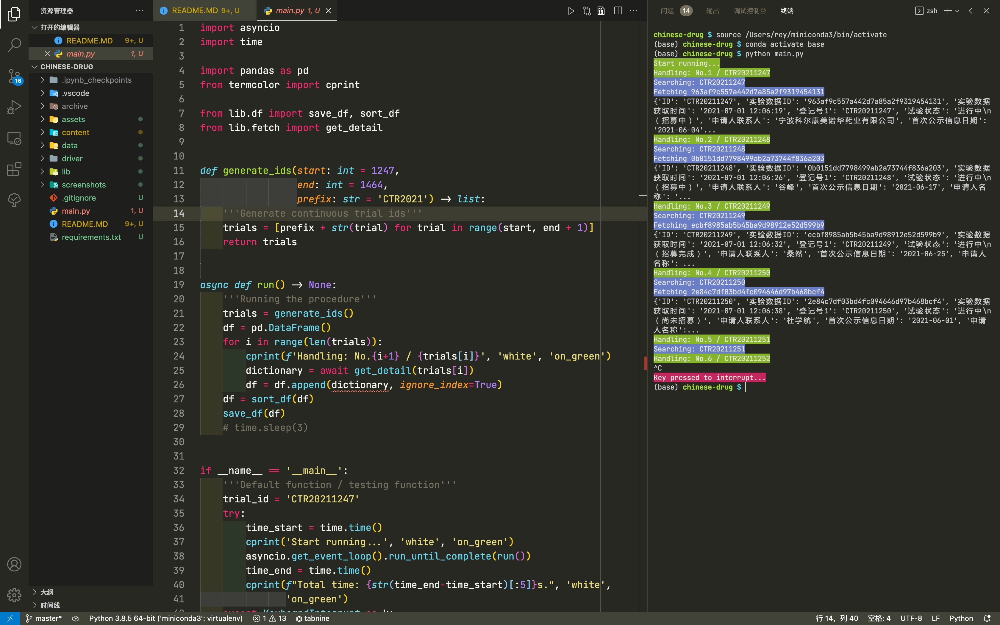
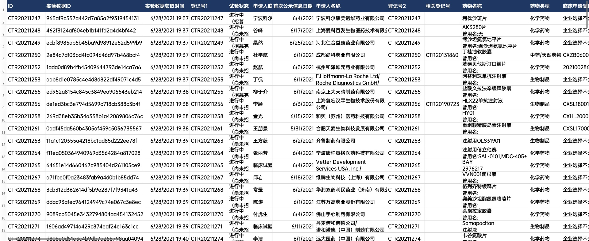

# 中国药物临床试验登记与信息公示平台爬虫

A web crawler for Chinadrugtrials.org.cn, written in Python 3.6+.


  

## 开始 START

1. Install requirements:   
  `pip install -r requirements.txt`  

2. Run:   
  `python main.py`

## 程序结构 PROGRAMME STRUCTURE

### 文件结构 File structure

``` Python
- main.py            # Start the whole project
- lib/fetch.py       # Network I/O
- lib/extract.py     # Data extraction
- lib/text.py        # Text tools for extraction
- lib/df.py          # Local I/O
```

### 函数用途和类型注释 Type & function annotations

  

## 输出数据 OUTPUT DATA


 

### 表格列 Table columns
`pd.DataFrame`:
``` Python
['ID', '实验数据ID', '实验数据获取时间', '登记号1', '试验状态', '申请人联系人', '首次公示信息日期', '申请人名称',
    '登记号2', '相关登记号', '药物名称', '药物类型', '临床申请受理号', '适应症', '试验专业题目', '试验通俗题目',
    '试验方案编号', '方案最新版本号', '版本日期', '方案是否为联合用药', '申请人名称', '联系人姓名', '联系人座机',
    '联系人手机号', '联系人Email', '联系人邮政地址', '联系人邮编', '试验目的', '试验分类', '试验分期', '设计类型',
    '随机化', '盲法', '试验范围', '受试者年龄', '受试者性别', '健康受试者', '受试者入选标准', '受试者排除标准',
    '试验药', '对照药', '主要终点指标及评价时间', '次要终点指标及评价时间', '数据安全监查委员会DMC', '为受试者购买试验伤害保险',
    '主要研究者信息', '各参加机构信息', '伦理委员会信息', '试验状态', '试验人数', '受试者招募及试验完成日期',
    ' 临床试验结果摘要']
```

### 变量 Variables

```
[trial_id, trial_id_hash, srcdate, regid, status, contact,
    pubdate, regstor, regno, relno, medname, medtype, recordno,
    indic, protitle, comtitle, planno, planver, verdate, united,
    regname, contname, contfixed, contmobile, contemail, contaddr,
    contzip, cltpps, clttype, cltpart, cltclass, cltrandom,
    cltblind, cltrange, subage, subsex, subheal, subin, subex,
    grpint, grpcomp, pind, sind, dmc, ins, prim, inst, ethic,
    tristatus, tripop, trirecru, triresult]
```

## 依赖 REQUIREMENTS
- Python [3.6+](https://www.python.org/downloads/release/python-360/) ([*f-string* 3.6+](https://www.python.org/dev/peps/pep-0498/) & [annotation 3.0+](https://www.python.org/dev/peps/pep-3107/))
- [Pyppeteer](https://pypi.org/project/pyppeteer/)   
Unofficial Python port of puppeteer JavaScript (headless) chrome/chromium browser automation library.  

- [Beautifulsoup4](https://pypi.org/project/beautifulsoup4/)  
Beautiful Soup is a library that makes it easy to scrape information from web pages. It sits atop an HTML or XML parser, providing Pythonic idioms for iterating, searching, and modifying the parse tree.  

- [Pandas](https://pypi.org/project/pandas/)  
Pandas is a Python package that provides fast, flexible, and expressive data structures designed to make working with structured (tabular, multidimensional, potentially heterogeneous) and time series data both easy and intuitive.  

- [Termcolor](https://pypi.org/project/termcolor/)  
Colored out in terminals.  


## 重要声明 MAJOR STATEMENT

**本项目用于技术学习和小型实验，禁止任何使用者用于盈利目的或违法用途。**  
This project is created for educational purposes in technology and forbiddened in any profitable activities nor illigal usage.  
  
**项目及其作者不对其他使用者的任何使用、传播及相应后果承担任何责任。**  
This project and its owner are not responsible for any usage, dissemination, and corresponding results of other users.